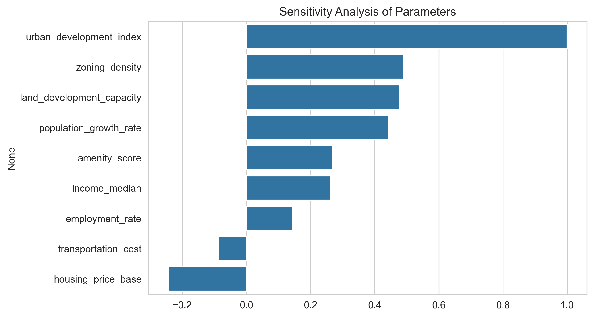

# Data Generation using Modelling and Simulation for Machine Learning

##  Overview
This project demonstrates how **modelling and simulation** can be used to generate synthetic data for machine learning applications. A custom-built **Urban Development Simulator** is designed to model urban system dynamics. The generated data is then used to train and evaluate multiple machine learning models to identify the best-performing model.

This work was completed as part of an academic assignment on **Data Generation using Modelling and Simulation for Machine Learning**.

---

## Objective
The objectives of this project are:
- To design a simulation model representing an urban system  
- To generate synthetic data using Monte Carlo simulation  
- To analyze the sensitivity of parameters on urban development  
- To compare multiple machine learning models using standard evaluation metrics  
- To identify the best-performing model  

---

## Simulation Tool
A **custom Urban System Simulator** inspired by **system dynamics and urban economics** is used. Instead of relying on an external simulator, a mathematical model is implemented to capture realistic and non-linear relationships between urban parameters.

### Input Parameters and Bounds

| Parameter | Description | Lower Bound | Upper Bound |
|---------|------------|-------------|-------------|
| Population Growth Rate | Annual population growth | 0.005 | 0.05 |
| Housing Price Base | Base housing cost | 100,000 | 500,000 |
| Employment Rate | Fraction of employed population | 0.5 | 0.95 |
| Land Development Capacity | Available land for development | 50 | 500 |
| Transportation Cost | Cost of mobility | 0.01 | 0.5 |
| Median Income | Median household income | 30,000 | 120,000 |
| Zoning Density | Allowed building density | 0.1 | 1.0 |
| Amenity Score | Availability of amenities | 0.0 | 10.0 |

### Output Variable
- **Urban Development Index (UDI)**: A synthetic index ranging from **0 to 100**, representing the overall level of urban development.

---

## Simulation Results

###  Distribution of Urban Development Index
The following plot shows the distribution of the Urban Development Index values across 1000 simulations.

---

###  Sensitivity Analysis of Parameters
This correlation-based sensitivity analysis highlights the influence of each input parameter on the Urban Development Index.

---

## Methodology
1. Defined realistic parameter bounds based on urban system assumptions  
2. Generated random parameter values using Monte Carlo sampling  
3. Ran **1000 independent simulations** using the simulator  
4. Recorded the resulting Urban Development Index  
5. Performed exploratory data analysis and sensitivity analysis  
6. Split data into training and testing sets  
7. Trained and evaluated multiple machine learning models  
8. Selected the best model based on performance metrics  

---

## Machine Learning Models Compared
- Linear Regression  
- Ridge Regression  
- Lasso Regression  
- Decision Tree Regressor  
- Random Forest Regressor  
- Gradient Boosting Regressor  
- XGBoost Regressor  
- LightGBM Regressor  
- Support Vector Regressor (SVR)  

---

## Model Performance Comparison

### Test R² Score Comparison
The following plot compares the Test R² scores of all machine learning models.

---

## Best Model Performance

### Actual vs Predicted Values
The scatter plot below shows the relationship between actual and predicted Urban Development Index values for the best-performing model.

---

## Evaluation Metrics
Models were evaluated using:
- **R² Score**  
- **RMSE (Root Mean Squared Error)**  
- **MAE (Mean Absolute Error)**  
- **5-Fold Cross-Validation R²**  

The best model was selected based on:
1. Highest Test R² score  
2. Lowest prediction error  
3. Stable cross-validation performance  

